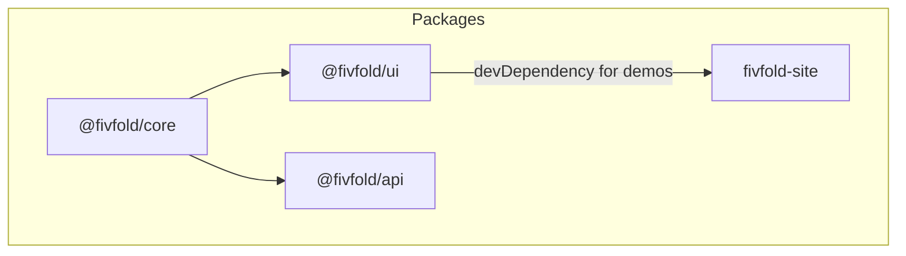

# FivFold

> **DISCLAIMER:** This is a pre-alpha release and currently under heavy testing and scrutiny. Until the first stable version (v1.0.0) is released, we advise not to use this in production.

**Full-stack scaffolding for TypeScript ecosystems.** Additional runtimes and stacks may follow.

FivFold adds **Kits** to your project via CLI: composable features (UI and optional backend scaffolding) as source you own—not a black-box dependency. Built on [shadcn/ui](https://ui.shadcn.com) and [Tailwind CSS v4](https://tailwindcss.com).

## What is FivFold

- **UI CLI** (`@fivfold/ui`): initialize and add Kits to React / Next.js (and compatible) apps.
- **API CLI** (`@fivfold/api`): scaffold backend modules aligned with your stack (framework, database, ORM) using the same manifest-driven model.

Use `list` on each CLI to see what Kits are available for that channel. Kits evolve over time; manifests in `ui/manifests/` and `api/manifests/` are the source of truth.

## Monorepo overview

pnpm workspace with four packages:



| Package | Description |
|---------|-------------|
| [**@fivfold/core**](./core/README.md) | Shared engine: VFS, StrategyPipeline, manifests, TemplateEngine, TsMorphEngine, detection, prompts |
| [**@fivfold/ui**](./ui/README.md) | Frontend Kits CLI: init, add, list, agents, setup |
| [**@fivfold/api**](./api/README.md) | Backend scaffolding CLI: init, add, list |
| [**fivfold-site**](./site/README.md) | Next.js docs site |

## Quick start

**Prerequisites:** Node.js 20+, [pnpm](https://pnpm.io)

```bash
pnpm install
pnpm run build
pnpm run dev:site
```

## Commands (root)

| Command | Description |
|---------|-------------|
| `pnpm install` | Install all workspace dependencies |
| `pnpm run build` | Build all packages |
| `pnpm run build:core` / `build:ui` / `build:api` | Build one package |
| `pnpm run dev:site` | Docs site (dev) |
| `pnpm run build:site` | Docs site (production build) |
| `pnpm release` | Interactive version bump for published packages (see [scripts/release.mjs](./scripts/release.mjs)) |

**UI CLI** (in a consumer project):

| Command | Description |
|---------|-------------|
| `npx @fivfold/ui init` | Initialize FivFold |
| `npx @fivfold/ui add <kit>` | Add a Kit |
| `npx @fivfold/ui list` | List Kits available from this CLI |
| `npx @fivfold/ui agents` | Agent-oriented instructions |
| `npx @fivfold/ui setup` | e.g. shadcn alignment |

**API CLI** (in a consumer project):

| Command | Description |
|---------|-------------|
| `npx @fivfold/api init` | Initialize FivFold |
| `npx @fivfold/api add <kit>` | Add a backend Kit |
| `npx @fivfold/api list` | List Kits available from this CLI |

## Project structure

```
fivfold/
├── core/src/       # VFS, strategy, manifest, template, AST, detection, prompts, workspace
├── ui/             # UI CLI — src/, manifests/, templates/
├── api/            # API CLI — src/, manifests/, templates/
├── site/           # Docs site (Next.js App Router)
├── AGENTS.md       # AI / contributor architectural rules
├── CONTRIBUTING.md # How to contribute
└── package.json
```

## Manifests

Kits are defined by declarative manifests (`*.kit.json`) under `ui/manifests/` and `api/manifests/`. They declare templates, dependencies, and AST targets; the CLIs orchestrate generation without hardcoding every stack combination.

## Configuration

- **File:** `fivfold.json` at the **consumer** project root (created by `init`).
- **Shared by:** UI and API CLIs (paths, stack choices, etc.).

## For contributors and agents

- **[AGENTS.md](./AGENTS.md)** — Architecture, constraints, and documentation conventions.
- **[CONTRIBUTING.md](./CONTRIBUTING.md)** — Setup, workflow, package-specific notes.

## Development notes

1. Build **core** before **ui** / **api** (workspace dependency).
2. The docs site depends on `@fivfold/ui` for demos; build `ui` when working on site features.

## License

MIT
